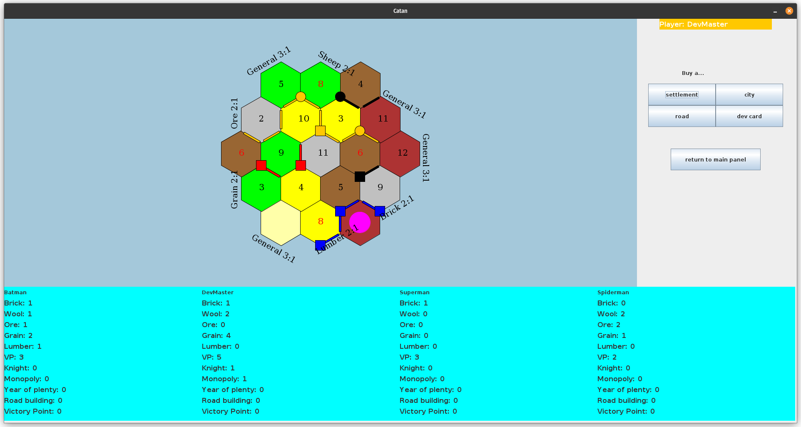

Settlers of Catan
================

This project is a Java implementation of the classic board game, "Settlers of Catan."   
Graphics make use of the Swing libraries.  
Project runs one game with input for four players (and open hand information), while fully automating all steps that don't require user input.

Much of the UI/UX could be improved.
For a true multiplayer experience, networking capabilities would be needed to support multiple devices, or player-state could be hidden for a pass-and-play approach.

